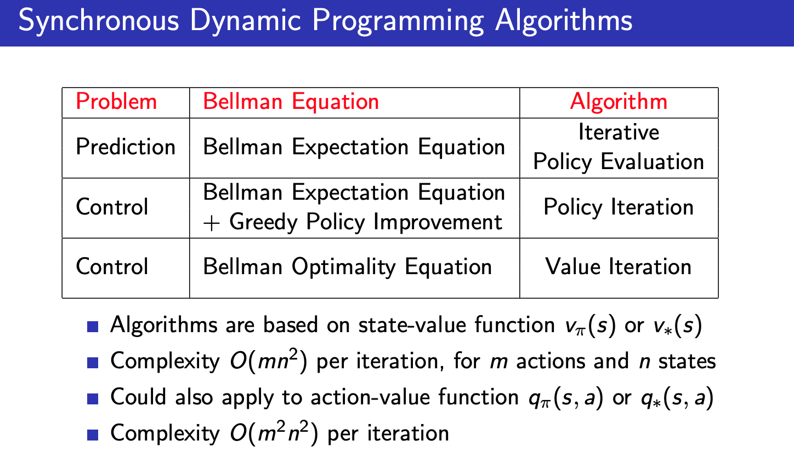

# 강화학습 3강 정리

Status: In Progress

# 1. Introduction

- Dynamic Programming
    - 복잡한 문제를 푸는 방법론
    - 큰 문제를 작은 문제로 나눠서, 작은 문제에 대해 솔루션을 찾아서, 찾은 모든 솔루션을 모은 것이 Dynamic programming
    - 강화학습 : 어떤 큰 문제
        - 모델 프리 : environment가 어떤걸 던져 줄지 모르는 상태 / 완전한 정보가 없을 때
        - 모델 베이스 : environment가 어떤걸 던져 줄지 알고 있는 상태 → DP가 쓰임

- DP가 쓰이기 위한 2가지 조건
    - Optimal substructure : 전체 큰 문제가 작은 문제로 나눌 수 있어야 함
    - Overlapping subproblems : 작은 문제의 솔루션을 갖고 있으면 다른 지점에서 동일한 문제가 발생하면 사용(캐시) 할 수 있음
    - Markov decision processes satisfy both properties : 위의 2가지 조건을 만족하여 DP 적용 가능
        - Bellman equation gives recursive decomposition
        - Value function stores and reuses solutions
- Planning by DP

    

    - DP는 MDP의 모든 정보를 알고 있음
    - MDP는 plannig에 쓰임
        - planning는 MDP를 푸는데, 모델을 알때 푸는 문제 = full knowledge
        - 푼다는 것은 prediction, control을 풀어야 함
    - prediction : value function을 학습 문제 (MDP가 있고, policy가 있을 때 value function가 어떻게 되는지를 return)
    - control : policy를 맞추는 문제 (MDP만 있을 때 optimal policy를 return)
- Other Applications of DP

    

# 2. Policy Evaluation(핵심) : Policy가 고정되어 있을 때 value function을 찾는 것

- Iterative Policy Evalution = prediction 문제

    

    - Bellman expectation backup을 사용
        - backup = 캐시와 비슷, 잠시 저장함
        - Synchronous Backup
            - 빈칸이 10개 있는 테이블이 있는데, 모든 칸에 있는 값을 업데이트
            - 계속하게 되면 v_pi에 수렴하게 됨
- Iterative Policy Evalution = prediction 문제

    

    - s는 더미 값이지만, 정확 값 r이 조금씩 업데이트 됨에 따라 수렴하게 됨 → 수렴 : 정확한 값으로 되고, 더이상 값이 변하지 않게 됨
- Random Policy

    

    - 주사위를 던져 1/4 확률로 이동 하였을 때, s→e까지 평균 몇회 시행되어야 하는가? / reward 회당 -1
- 초기화 k에 따른 변화

    

    

# 3. Policy Iteration(핵심) : Iteration 방법론을 통해 최적의 Policy를 찾는 방법(Policy 기반)

- Improve Policy

    

    

    - 2개를 왔다갔다함 (evaluation ←→ improvement 반복)

    

- Example : Jack`s Car Rental

    

    - A zone : 푸아송 분포에 의해 고객이 방문 (평균 3회 빌림, 3회 반납)
    - B zone : 푸아송 분포에 의해 고객이 방문 (평규 4회 빌림, 2회 반납)
    - 1개 zone에 차량은 최대 20대 보유
    - action : 차량을 이동하는게 최대 5대 이동 가능
    - reward : 고객이 빌리는 비용은 10$

    

    - x : B zone의 차의 수, y : A zone의 차의 수
    - 처음은 아예 움직이지 않는 policy 에서 시작
    - 420, 612는 return
- Policy Improvement

    

    

- Modified Policy Iteration

    

    - policy evaluation 과정에서 v_pi에 꼭 수렴해야 하는가? 아니면 좀 더 일찍 끝내면 안되는가? 아니면 k = 3번만 하면 안되는가?
    - 결론 : 이렇게해도 완전히 합리적인 알고리즘 이다
- Generalised Policy Iteration

    

# 4. Value Iteration(핵심) : Iteration 방법론을 통해 최적의 Policy를 찾는 방법(Value 기반)

- Principle of Optimality

    

- Deterministic Value Iteration

    

    - s 프라임 : s에서 갈 수 있는 state
    - Bellman Optimality expectation (max로 엮여 있어서, 역행렬로 넘길 수가 없어, 이터레이터로 계산해야 함) ←→ Bellman expectation (반대)

        

    - Example : 최단거리 찾기

        

        - 모든 스테이트를 훑어서 모든 스테이트를 업데이트함
- Value Iteration

    

    - 문제 : optimal policy pi를 찾음
    - 해결책 : Bellman Optimality backup을 iterative 사용

    

- Synchronous DP Algorithms

    

    - Synchronous 예제 : 한 타이밍에 모든 state를 업데이트
    - predict 문제
        - Bellman Expectation Equation 사용하고, 알고리즘은 Policy Evaluation
    - control 문제
        - Policy Iteraton : Bellman Expectation Equation + Greedy Policy Improvement 사용
        - Value Iteration : Bellman Optimality Equation  사용

# 5. Extensions to Dynamic Programming (부수적)

- Asynchronous DP

    

    - DP는 모든 synchrounous backups만 사용
    - Ansynchrounous 사용 가능, compitation을 줄일 수 있으나, 여러 state에서 무한번 뽑는 모델이 보장 되어야 함
- 구분 1
    - In-place DP
        - 코딩 테크닉에 더 가까움
        - value function은 1개 테이블만 갖고 있어, 1개 업데이트만 진행
    - Prioritised sweeping
        - 우선 순위를 정하고, 그 순위에 맞춰 업데이트 진행
    - Real-time DP
        - agent를 움직이게 하고, 방문한 state 순서에 맞춰 업데이트
- 구분2
    - Full-Width Backups
        - DP는 full-width backups를 사용
        - 큰 문제에서는 모든 state를 방문하고 업데이트하는게 불가능
    - Sample Backups
        - state가 많아져도, 고정된 cost로 진행 가능
        - 액션하면서 sample backups 진행 → 모델을 몰라도 진행 가능(장점)

# 6. Contraction Mapping (증명)

---

reference

- [팡요랩 : [강화학습 3강] Planning by Dynamic Programming](https://www.youtube.com/watch?v=rrTxOkbHj-M)
- [RL Course by David Silver - Lecture 3: Planning by Dynamic Programming](https://www.youtube.com/watch?v=Nd1-UUMVfz4&list=PLqYmG7hTraZDM-OYHWgPebj2MfCFzFObQ&index=3)
- [RL Course by David Silver 교재 - Lecture 3](http://www0.cs.ucl.ac.uk/staff/d.silver/web/Teaching_files/DP.pdf)