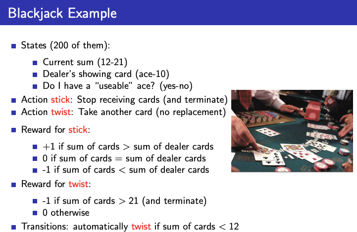
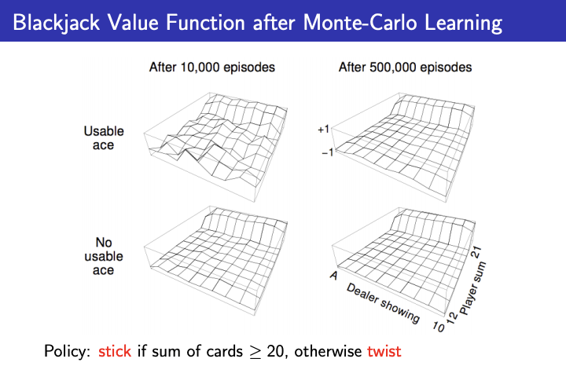
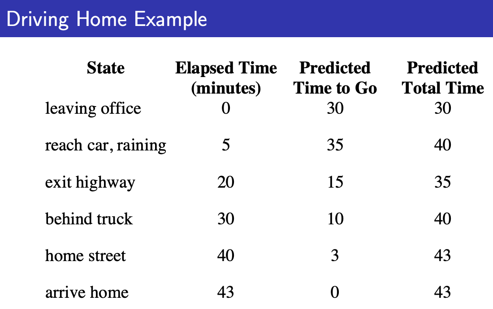
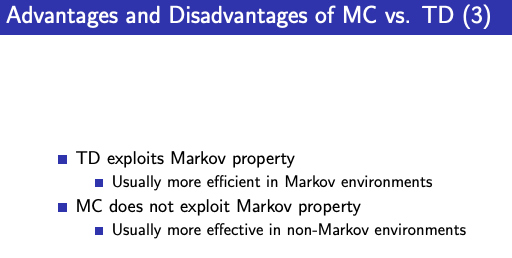
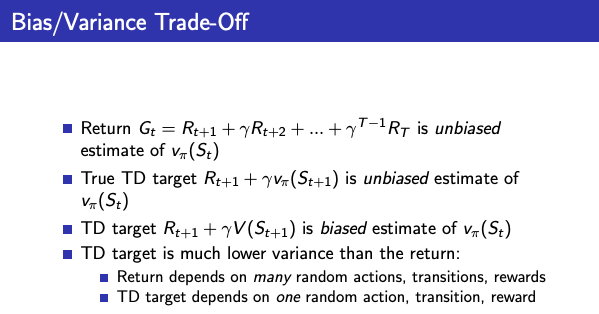
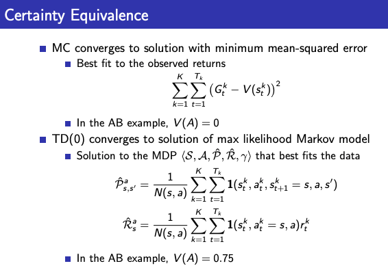
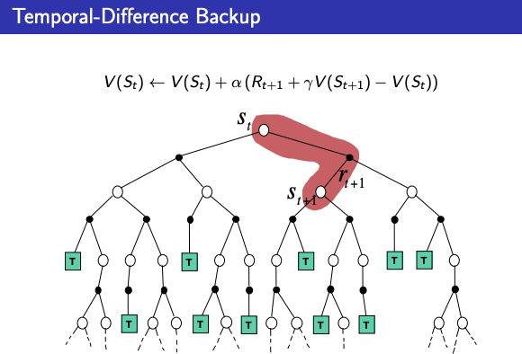

# 강화학습 4강 : [Model Free Prediction](https://www.youtube.com/watch?v=47FyZtBRglI&t=5s)

# 1. Introduction

- Model-Free Reinforcement Learning
    - 이전 강의 : Planning by Dynamic Programming → Slove a known MDP
    - 이번 강의 : Model-Free prediction → Estimate the value function of an unknown MDP
    - 다음 강의 : Model-Free control → Optimise the value function of an unknown MDP

# 2. Monte-Carlo Learning (MC)

- Monte-Carlo Reinforcement Learning
    - MC? 실제 값을들을 통해서 추정하는 방식 (경험을 통해 학습하는 방식)
        - Value Function이 MC가 학습하는 방법 : Policy는 정해져 있기 때문에, Policy를 따라서 학습을 끝까지 하면서, return 되는 값의 평균으로 Value-Function을 구함
    - MC는 에피소드가 끝나야만 return이 확정됨에 따라, 에피소드가 끝나는 부분만 적용 가능
- Monte-Carlo Policy Evaluation = prediction

    

    - 목적 : 에피소드로부터 v_pi를 학습
    - return : discounted reward
    - value-function : return의 기대값 → return은 확률변수
    - Monte-Carlo Policy Evalution은 return의 empirical mean을 사용 (실제적으로해서 그 통계를 활용)
- First-Vist Monte-Carlo Policy Evaluation
    - state의 저장 공간이 있고, 방문할때마다 count를 기록하며, 에피소드 종료 이후에 각 state별 기대값을 기록하는데, 처음 방문한 것만 counter : `N(s) ← N(s) + 1`
    - total return : `S(s) ← S(s) + G_t`
    - Value-function : `V(s) = S(s)/N(s)` → return도 처음 방문한 것만
    - 큰 수의 법칙 : `V(s) → v_pi(s) as N(s) → infinity`
- Every-Visit Monte-Carlo Policy Evaluation
    - state의 저장 공간이 있고, 방문할때마다 count를 기록하며, 에피소드 종료 이후에 각 state별 기대값을 기록하는데, 여러번 방문한 것을 모두 counter : `N(s) ← N(s) + 1`
    - total return : `S(s) ← S(s) + G_t`
    - Value-function : `V(s) = S(s)/N(s)`
    - 큰 수의 법칙 : `V(s) → v_pi(s) as N(s) → infinity`
- First-Vist & Every-Visit Monte-Carlo Policy Evaluation
    - 가정 : 모든 state를 방문한다
    - First-Visit 와 Every-Visit 모두 결과는 같으나, 구현 방식의 차이가 있다.
- Blackjack Example

    

    

    - Policy
        - 취할 수 액션 : stick, twist
    - state가 3,000인데, x축은 딜러, y축은 플레이어의 sum
    - ace 보유 여부에 따라 다르지만, 에피소드 시행 건수가 많아짐에 따라, 동일한 결과로 수렴
    - evaluation만 실행 → control은 5강에서 다룰 예정
- Incremental Mean

    

    - 기존에는 에피소드마다 reward의 평균을 기록해야 했으나, 저장 안해도 새로운 값이 나올 때마다 Incremental(Incremental mean)하게 교정해주면 대체할 수가 있음

    

    - 기존  Monte-Carlo Policy Evaluation 방식과 동일한 counter : `N(S_t) ← N(S_t) + 1`
    - 다만 V에서 Incremental을 적용한 차이가 있음 :  `V(S_t) ← V(S_t) + 1/N(S_t)(G_t - V(S_t))`
    - 오래된 기억을 잊어버려야 할 경우에는 alpha를 고정해서 구성 (non-stationary problems) : `V(S_t) ← V(S_t) + \alpha(G_t - V(S_t))`

# 3. Temporal-Difference Learning (TD)

- Temporal-Difference Learning
    - 경험으로 학습 / model-free 가 MC와 동일
    - 에피소드를 종료하지 않고도 학습이 가능 (by bootstrapping)
    - guess toward a guess : 추측에 추측으로 업데이트함
- MC and TD

    

    - MC는 G 방향으로 V를 업데이트 : `V(S_t) ← V(S_t)+\alpha(G_t - V(S_t))`
    - TD는 R+gammaV 방향으로 V를 업데이트 : `R_t+1 + \gamma*V(S_t+1) - V(S_t))`
    - TD target : `R_t+1 + \gamma * V(S_t+1)``
    - TD error : `\sigma_t = R_t+1 + \gamma * V(S_t+1) - V(S_t)`
    - 한 스텝만큼 현실이 반영되서, 결과적으로는 한 스텝만큼씩 교정이 되어감
- TD Example : Driving Home

    

    

    - state 6개가 있고, state별로 앞으로 걸릴 시간을 예측
- Advantages and Disadvantages of MC vs TD

    

    - TD
        - 에피소드가 완료되기 전에 return을 알 수 있다.
        - 계속되는 환경(non-terminating)에서 활용 가능
    - MC
        - 에피소드가 완료되어야 return을 알 수 있다.
        - 종료된 환경(terminating)에서만 활용 가능

    

    - TD
        - variance가 작고, bias가 조금 있어서 MC보다 보통 효과적
        - TD(0)는 v_pi에 수렴
        - initial value에 sensitive (민감함) → initial value가 잘 설정되어 있으면 잘 수렴함
        - function approximation 쓴다고 해서 항상 수렴되지 않음
    - MC
        - variance가 크고, bias가 0이다.
        - 수렴 성질이 좋음 → 딥러닝(function approximation)을 써도 좋음
        - initial value가 sensitive하지 않으며, 쉽게 이해하고 사용할 수 있음

    

    - TD : Markov property를 사용해서 value를 추측(Markov Environments에서 사용이 적절) , markov model의 likehood를 맥시마이즈
    - MC : MSE를 미니마이즈
- Bias / Variance Trade-Off

    

    - unbiased estimate : 편향되지 않았다
        - return G_t : `R_t+1 + \gamma * R_t+2 + ... + \gamma^T-1 * R_t` → v_pi는 g_t 기대값이 v_pi(S_t) 이기 때문에, g_t를 계속 샘플링하면 평균이 v_pi로 기대값이 수렴하게 됨
        - True TD target : `R_t+1 + \gamma * v_\pi(S_t+1)` ← 어떤 신이 v_pi를 알려준 경우, Bellman equation이 보장
        - 현재의 추측치인 V(s_t+1)를 하는데 biased 되어 있음 → 100만번 시행한다 하더라도, v_pi 된다는 보장이 없음
        - biased 관점에서는 TD가 매우 안 좋으나, variance 관점에서는 TD 타켓은 variance가 매우 낮음
- MC vs TD Example : Random Walk

    

    

    - 술 취한 사람이 양 방향으로 랜덤하게 움직이는 policy
    - Policy를 통해 각각의 state를 평가 → E 쪽에 가까울수록 Value가 높음
    - 에피소드를 0번째 학습 했을 때 0.5로 inital value 설정
    - 실제 value와 추정한 value를 RMSE로 평가
- Batch MC and TD

    

    - 에피소드를 무한번 시행하면 infinity에 수렴하는 것을  알고 있음
    - 그렇다면 k번의 유한번 시행을 한다면? MC랑 TD는 어떤 value에 수렴할까?
    - AB Example

        

        - state : A, B
        - 에피소드 : 8번
        - model free라서 규칙을 알 수 없는 상태 → 경험을 통해 MC와 TD를 할 수 있음
        - Certainty Equivalence

            

            - gamma는 1이라고 가정
    - Monte-Carlo Backup

        

        - S_t 에서 시작
        - 알파고에서 쓰인 것과 비슷 → MCTS
    - Temporal-Difference Backup

        

        - 1 step만 가보고, 계산하고 그걸로 대체 (bootstrapping : 추측치로 추측치를 업데이트) → TD(0)
        - TD(1) → 2 step, TD(2) → 3 step, ...
    - Dynamic Programming Backup

        

        - 모든 칸의 액션을 1 step 해보고 value를 업데이트 (끝가지 가지 않음)
    - Boostrapping and Sampling

        

        - Boostrapping
            - O : DP, DP
            - X : MC
        - Sampling
            - O : MC, TD
            - X : DP

# TD(lambda)

- n-Step Prediction

    

- n-Step Return

    

    

    - TD(0) ~ TD(1000)까지 성능 비교
    - On-Line : 움직이는 도중에 업데이트, Off-Line : 끝나고 업데이트
    - 그래프가 아래로 갈수록 좋은 경우
- Averaging n-Step Returns

    

- \lambda-return (TD \lambda : TD(0) ~ MC까지 모든것을 평균내도 됨)

    

    - Geo-matrix mean
- TD(\lambda) Weighting Function

    

    - TD(0)과 같은 cost로 TD(\lambda)를 계산할 수 있음

    

    

- Backward-view TD(\lambda)

    

    

    - 어느 사건에 책임을 묻는 방식 : 책임이 큰 애한테 업데이트
    - Frequency : 많이 일어난 애 / Recency : 최근에 일어난 애 → 책임을 묻는 기준

    

    - 매 과거마다 책임의 소지를 기록해 둠 → TD(\lambda)와 수학적으로 의미를 갖게 됨
- Summary

    

---

reference

- [팡요랩 : [강화학습 4강] Model Free Prediction](https://www.youtube.com/watch?v=47FyZtBRglI&t=5s)
- [RL Course by David Silver - Lecture 4: Model-Free Prediction](https://www.youtube.com/watch?v=PnHCvfgC_ZA&index=4&list=PLqYmG7hTraZDM-OYHWgPebj2MfCFzFObQ)
- [RL Course by David Silver 교재 - Lecture 4](http://www0.cs.ucl.ac.uk/staff/d.silver/web/Teaching_files/MC-TD.pdf)